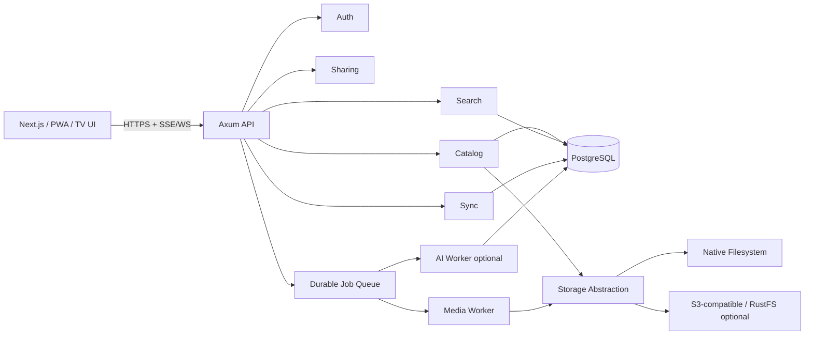

# Architecture

## 1. Architecture Style

Start as a **modular monolith in Rust** with separately deployable workers only where isolation is operationally useful. Avoid premature microservices.



## 2. Why Rust

Use Rust where it materially helps:
- concurrent scanning/indexing;
- high-throughput upload/download streaming;
- BLAKE3 hashing;
- safe filesystem operations;
- long-running daemon reliability;
- media job orchestration;
- resource-bounded background work;
- protocol implementations.

Do not use Rust as an excuse to reimplement PostgreSQL, FFmpeg, image codecs, or mature standards.

## 3. Core Crates

### `domain`
Pure types, IDs, authorization concepts, value objects, invariants. Minimal dependencies.

### `storage`
Backend-neutral interface:

```rust
trait StorageBackend {
    async fn stat(&self, key: &StorageKey) -> Result<ObjectStat>;
    async fn open_range(&self, key: &StorageKey, range: ByteRange) -> Result<ByteStream>;
    async fn write_atomic(&self, request: WriteRequest, body: ByteStream) -> Result<WriteReceipt>;
    async fn move_object(&self, from: &StorageKey, to: &StorageKey) -> Result<()>;
    async fn delete(&self, key: &StorageKey) -> Result<()>;
}
```

The actual interface should be refined through TDD and object-safety/streaming requirements; this snippet establishes responsibility, not final syntax.

Backends:
- filesystem;
- optional S3-compatible;
- read-only imported root mode.

### `catalog`
Files, folders, media assets, extracted metadata, scans, watchers, change reconciliation.

### `auth`
Passkeys, sessions, OIDC, device grants, capability grants, rate limiting hooks.

### `sharing`
Share lifecycle, passwords, expiration, download/upload permissions, public landing state.

### `search`
Query parser, PostgreSQL lexical search, filters, optional semantic provider.

### `sync`
Change sequence, per-device cursor, offline pin intent, conflict detection.

### `jobs`
Durable job state. Jobs must be idempotent and resumable where practical.

### `media`
Metadata extraction, thumbnails, posters, transcodes, visual hashes.

### `observability`
Tracing fields, metrics, audit events, request IDs, privacy-aware logging.

## 4. Database

PostgreSQL is metadata/control-plane storage, not the source of truth for original filesystem-backed files.

Use SQLx migrations. Critical schema changes must include:
- migration plan;
- backward/forward compatibility story;
- index impact;
- lock risk analysis;
- rollback or roll-forward strategy.

See `DATA_MODEL.md` and PlanetScale Postgres workflow in `SKILLS_AND_AGENT_WORKFLOW.md`.

## 5. Job Model

Initial implementation may store jobs in PostgreSQL with `FOR UPDATE SKIP LOCKED`, bounded worker concurrency, leases, attempts, and next-run timestamps. Do not introduce Redis solely for queues before measurements justify it.

Job properties:
- idempotency key;
- kind/version;
- input reference;
- state;
- attempts;
- lease owner/expiry;
- progress;
- structured last error;
- created/started/completed timestamps.

Examples:
- hash_file;
- extract_image_metadata;
- generate_thumbnail;
- generate_video_poster;
- extract_text;
- compute_embedding;
- reconcile_root;
- create_version_cleanup_candidates.

## 6. Realtime

Use Server-Sent Events for one-way status streams where sufficient. Use WebSocket only for bidirectional interactions that require it.

Event categories:
- transfer progress;
- job progress;
- catalog changes;
- device status;
- share activity where enabled.

Events are hints; clients must be able to recover authoritative state through REST/query APIs.

## 7. Transfers

### Upload
Use a resumable session protocol owned by the API. Consider tus compatibility only if it meaningfully reduces implementation risk.

Flow:
1. create upload session;
2. reserve destination and policy check;
3. stream chunks;
4. persist offset/checkpoint;
5. finalize atomically;
6. enqueue indexing/derivatives;
7. verify hash if calculated.

Never buffer an entire large upload in RAM.

### Download
- authorization before opening the file;
- support HTTP range;
- stream with bounded buffers;
- safe content disposition;
- ETag based on stable version identity where possible.

## 8. Indexing

The catalog maintains a logical record for each discovered item. A scan has two layers:

1. **fast discovery:** path, stat data, basic MIME/type;
2. **enrichment:** hash, EXIF, thumbnails, text, embeddings.

Browsing must not wait for enrichment.

Use filesystem watchers only as accelerators. Periodic reconciliation remains authoritative because watchers can drop events or be unavailable on network filesystems.

## 9. File Operations

Filesystem mutations require race-aware behavior:
- validate authorization against logical resource;
- resolve current physical location;
- use atomic rename where supported;
- detect cross-filesystem move and fall back to verified copy + delete;
- write temporary files in destination filesystem then rename;
- never overwrite unexpectedly;
- record result transactionally with catalog reconciliation.

## 10. Versioning

Portable v1 strategy:
- before replacing/deleting a versioned file, move/copy the prior content into an application-managed `.homecloud-versions` area or configured version store;
- maintain version metadata in PostgreSQL;
- apply retention asynchronously;
- never prune the last original due to duplicate heuristics.

Backend-specific snapshot integrations can come later.

## 11. Optional RustFS/S3 Mode

RustFS is a good optional backend when the operator wants S3-compatible distributed object storage. It is **not** required in filesystem mode.

S3/object mode accepts that objects may no longer map 1:1 to a human-browsable native path. The UI must communicate this storage mode clearly.

## 12. AI Boundary

AI never receives arbitrary data without explicit provider policy. Provider interface records:
- local vs remote;
- allowed media types;
- max bytes;
- retention expectations;
- whether raw content leaves the server.

Remote AI providers are opt-in and visibly marked.

## 13. Deployment Profiles

### Solo
- `web`
- Rust API
- PostgreSQL
- same-host filesystem
- media worker in same process or sidecar

### Home server + NAS
- API on mini-PC
- PostgreSQL on local SSD
- media roots mounted from NAS
- derivatives/cache on SSD

### Advanced
- API replicas behind reverse proxy
- PostgreSQL HA by operator choice
- S3/RustFS backend
- separate media/AI workers

The app must not require the Advanced profile for normal features.

## 14. Observability

Use `tracing` structured spans. Standard dimensions:
- request_id;
- user_id (opaque internal ID, never email);
- operation;
- storage_backend;
- root_id;
- job_kind;
- duration;
- bytes.

Never log share secrets, session secrets, passkey secrets, raw document content, OCR text, or full sensitive paths at default log level.

## 15. Architecture Fitness Rules

A PR fails architecture review if it:
- bypasses the storage abstraction from unrelated modules;
- stores original file bytes in PostgreSQL;
- performs blocking heavy work on async request executors;
- requires AI for core browsing/search filters;
- creates a second source of truth for filesystem originals;
- introduces a network service without an operational need and failure model;
- leaks domain authorization into frontend-only checks.
